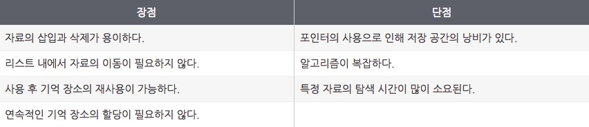
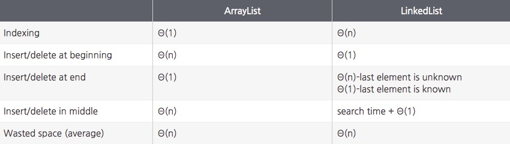

## Array, ArrayList, LinkedList

### Array

> 배열. 선언시 크기 정해진다. 따라서 원소의 크기 만큼 메모리(공간)가 확보 되어 있어야 한다. index를 갖고 있기 때문에 random access(임의 접근) 가능하다.

**시간복잡도**

읽기 - O(1)

원소 추가 및 삭제 - O(n)

 

 

### ArrayList

> 배열리스트. 크기가 정해져 있지 않다(제한도 없다. 메모리가 허용하는 범위까지). 기본적으로 배열 구조를 하고 있다. index를 갖고 있기 때문에 random access(임의 접근) 가능하다.

**시간복잡도**

읽기 - O(1)

원소 추가 및 삭제(처음 or 중간) - O(n)

원소 추가 및 삭제(끝) - O(1)

 

 

### LinkedList

> 연결리스트. 크기가 정해져 있지 않다(제한도 없다. 메모리가 허용하는 범위까지). 각 node는 서로 다른 주소에 위치하고 있어도 상관 없기 때문에 메모리 사용 효율이 배열에 비해 좋다. node는 값과 다음 node의 주소를 갖고 있다. index가 없기 때문에 random access(임의 접근) 불가능하고 sequential access(순차 접근) 가능하다

**시간복잡도**

읽기 - O(n)

원소 추가 및 삭제(node 주소를 모른다면) - O(n) (처음부터 순차적으로 접근해야하기 때문)

원소 추가 및 삭제(node 주소를 알고 있다면) - O(1) (가장 첫 node는 바로 주소를 확인할 수 있기 때문에 추가 및 삭제 시 항상 O(1)이다)

 

 

### ArrayList와 LinkedList 비교

 

 

참조

https://m.blog.naver.com/PostView.nhn?blogId=kks227&logNo=220781402507&proxyReferer=https%3A%2F%2Fwww.google.co.kr%2F

http://www.nextree.co.kr/p6506/