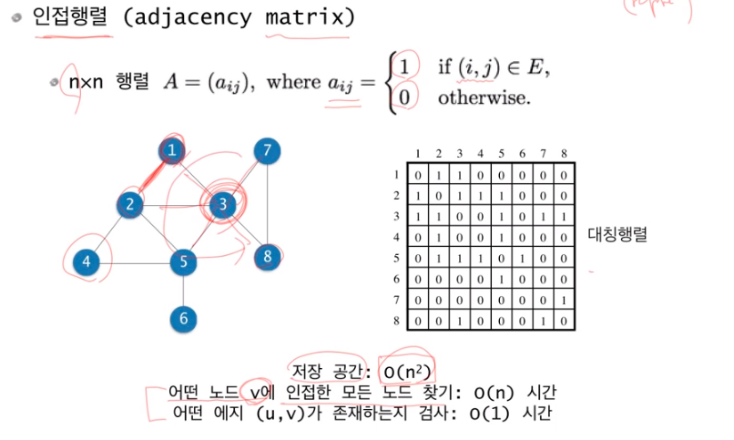
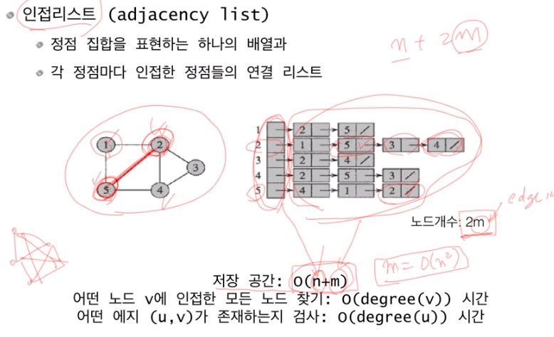
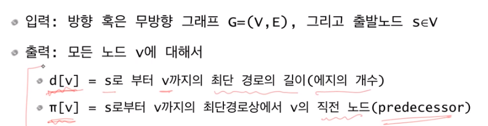
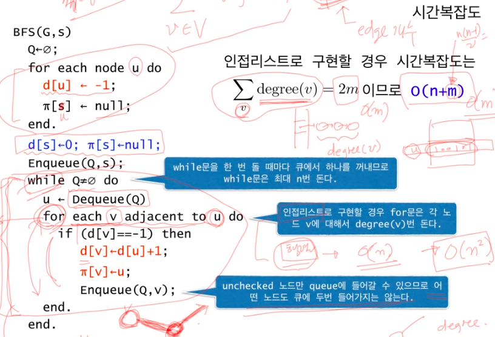
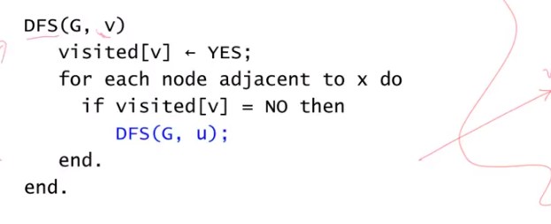
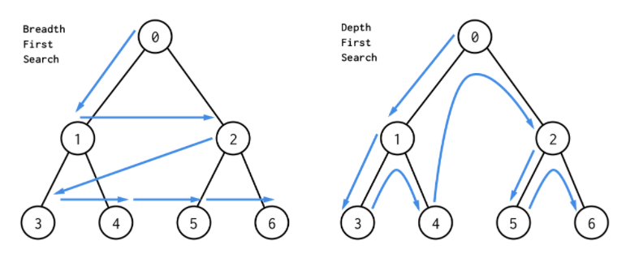
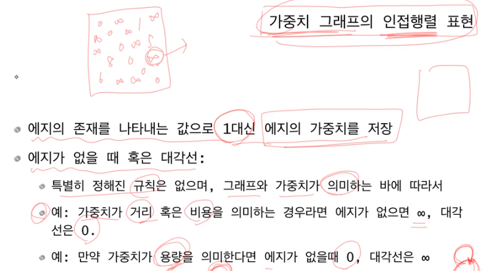
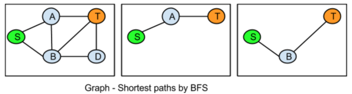
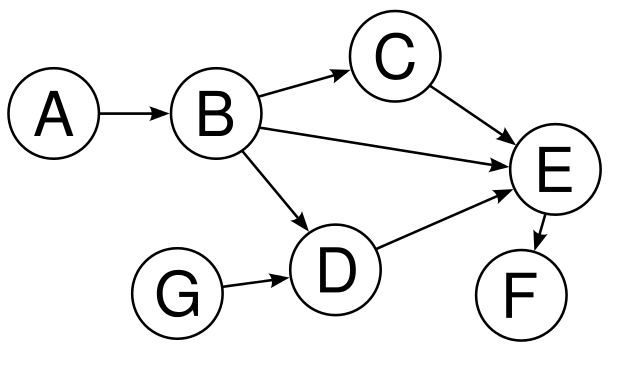
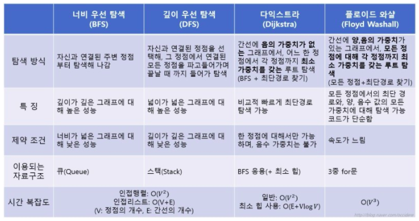

## Graph
> 연결의 집합을 모형화한 것
>
> node(vertex)와 edge(link)로 구성
>
> 무방향 그래프, 방향 그래프가 있음

 

### graph의 표현

#### 인접 행렬(adjacent matrix, 정방 행렬을 사용하는 방법)

 

해당하는 위치의 value 값을 통해서 vertex간의 연결 관계를 O(1) 으로 파악할 수 있다. Edge개수와는 무관하게 V^2의 Space Complexity를 갖는다. Dense graph를 표현할 때 적절할 방법이다

 

#### 인접 리스트(adjacent list, 연결 리스트를 사용하는 방법)

 

vertex의 adjacent list를 확인해봐야 하므로 vertex간 연결되어있는지 확인하는데 오래 걸린다. Space Complexity 는 O(E + V)이다. Sparse graph를 표현하는데 적당한 방법이다

degree : Undirected Graph에서 각 정점(Vertex)에 연결된 Edge의 개수를 Degree라 한다. Directed Graph에서는 간선에 방향성이 존재하기 때문에 Degree가 두 개로 나뉘게 된다. 각 정점으로부터 나가는 간선의 개수를 Outdegree라 하고, 들어오는 간선의 개수를 Indegree라 한다

 

-----

### graph의 탐색

그래프는 정점의 구성 뿐만 아니라 간선의 연결에도 규칙이 존재하지 않기 때문에 탐색이 복잡하다. 따라서 그래프의 모든 정점을 탐색하기 위한 방법은 다음의 두 가지 알고리즘을 기반으로 한다

 

#### 너비 우선 탐색(Breadth First Search: BFS)

그래프 상에 존재하는 임의의 한 정점으로부터 연결되어 있는 모든 정점으로 나아간다. Tree에서의 Level Order Traversal 형식으로 진행되는 것이다. BFS에서는 자료구조로 Queue를 사용한다. 연락을 취할 정점의 순서를 기록하기 위한 것이다. 우선, 탐색을 시작하는 정점을 Queue에 넣는다.(enqueue) 그리고 dequeue를 하면서 dequeue하는 정점과 간선으로 연결되어 있는 정점들을 enqueue한다. 즉 vertex들을 방문한 순서대로 queue에 저장하는 방법을 사용하는 것이다. BFS로 구한 경로는 최단 경로이다

* Time Complexity : O(V+E)(인접 리스트로 구현한 경우), O(V^2)(인접 행렬로 구현한 경우)

* pseudo code

 

#### 깊이 우선 탐색(Depth First Search: DFS)

그래프 상에 존재하는 임의의 한 정점으로부터 연결되어 있는 한 정점으로만 나아간다라는 방법을 우선으로 탐색한다. 연결할 수 있는 정점이 있을 때까지 계속 연결하다가 더이상 연결되지 않은 정점이 없으면 바로 그 전 단계의 정점으로 돌아가서 연결할 수 있는 정점이 있는지 살펴봐야 할 것이다. 갔던 길을 되돌아 오는 상황이 존재하는 미로찾기처럼 구성하면 되는 것이다. DFS는 Stack 자료구조를 사용한다

* Time Complexity : O(V+E)(인접 리스트로 구현한 경우), O(V^2)(인접 행렬로 구현한 경우)

* pseudo code

 

#### BFS vs DFS

* node 방문 순서

BFS는 최단경로를 탐색하거나, 공간 여유가 있을 때 사용한다. DFS는 미로를 탐색하거나 공간 여유가

 

-----

### 가중 그래프(weighted graph)

edge에 가중치(weight)가 존재하는 graph. weighted graph에서 최단 경로를 탐색 할 때는 dijkstra's algorithm을 사용하고 unweighted graph에서 최단 경로를 탐색 할 때는 BFS를 사용한다

 

#### dijkstra's algorithm

나중에 정리...잘 이해 안된다...

* 최단 경로 탐색 비교

BFS

dijkstra's algorithm

다중 시작점은 클루이드

 

-----

### 방향성 비순환 그래프(DAG, Directed Acyclic Graph)

방향 그래프 중 사이클이 없는 그래프

 

### 탐색 비교

 

참고

https://m.blog.naver.com/occidere/220923695595
