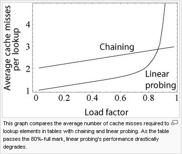

## Hash Table
> hash function과 array를 합쳐 만든 자료 구조. 어떤 항목과 다른 항목간의 관계 및 연결을 표현하고자 할 때 사용한다

 

 

 

### hash function

* 문자열에 대해 숫자를 할당(mapping)한다

* 일관성이 있어야 한다(deterministic)

* 서로 다른 값에 대해 서로 다른 숫자가 나와야 한다(이상적)

* 이 때, 배열이 얼마나 큰지 알고 있어야 하며, 유효한 인덱스만 반환해야 한다. 만약 배열이 5개의 원소만 가질 수 있다면 100을 반환해서는 안된다

* hash table은 key와 value를 갖는다(ex-전화번호부, 이름과 번호의 관계). hash table은 순서를 가지지 않기 때문에 key-value 쌍을 어떤 순서로 추가하든 상관없다

* 해시 맵(hash maps), 맵(maps), 딕셔너리(dictionaries), 연관 배열(associative arrays) 모두 hash table이다

* 어떤 항목을 다른 항목과 연결 시키고자 할 때, 무엇인가를 찾고자 할 때 자주 사용된다

* 좋은 hash function이란?

  - 배열 항목에 값을 고루 분포 시키는 함수

  - 현실에서는 키들이 랜덤하지 않다

  - 만약 키들의 통계적 분포에 대해 알고 있다면 이를 이용해서 hash function을 고안하는 것이 가능하겠지만 현실적으로 어렵다

  - 키들이 어떤 특정한 패턴을 가지더라도 hash function의 return 값은 불규칙하게 되는 것이 바람직하다(키의 특정 부분에 의존해서 return 값이 결정되지 않아야 한다)

 

 

### example

* DNS 확인 작업에 사용. URL과 IP 주소 mapping

* web에서 사용되는 caching에 사용. caching은 값을 저장해두고 있다가 필요할 때 사용하는 것을 말한다

* 장점

  - 어떤 것과 다른 것 사이의 관계를 모형화 할 수 있다

  - 중복을 막을 수 있다

  - 서버에 작업을 시키지 않고 자료를 caching할 수 있다

 

 

### collision

* 여러 개의 키가 같은 슬롯을 할당하게 되는 경우 발생하는 문제, h(k1) = h(k2)

* 100만개의 크기를 가지는 해쉬 테이블에 뛰어난 해쉬 함수로 가지고 있다고 해도, 대략 2500개의 레코드가 찼을 때 충돌이 발생활 확률은 95%에 이른다고 한다. 따라서 충돌 해결을 필수적이다. 만약 hash function이 단사 함수(정의역과 치역이 1:1 대응)이라면 이는 좋은 hash function이 될 수 있겠지만, 데이터의 크기만큼 hash table의 크기가 커지는 것을 불가능하며, 이는 배열이나 다름 없다

 

 

### how to resolve collision

  #### chaining

  * data를 hash table의 각 bucket에 list를 만들어 key를 보관한다 (bucket 내부에서 red-black tree를 활용해 data를 보관하는 경우도 있다. 데이터의 크기가 커지면 이 방법이 더 유용하다. key-value 쌍이 6, 8개를 기준으로 8개를 넘어가면 red-black tree를 활용하고, 6개로 적어지면 linked list를 활용한다)

  * 시간 복잡도

  

  

  흔히 hash table의 평균 검색 시간을 O(1)이라고 하는데, 이는 각각의 키가 모든 슬롯에 균등한 확률로 독립적으로 hashing된다는 가정(SUHA, simple uniform hashing assumption)이 필요하다. 그래서 사용률이 1이하가 된다면 평균 검색 시간을 O(1)이라고 할 수 있다

 

  #### open addressing

  * hast table의 bucket에만 key를 보관한다

  * 각 bucket에는 1개의 key만 저장한다

    1. linear probing

    

    primary cluster : key에 의해 채워진 연속된 bucket을 의미

    이런 cluster가 생성하면 cluster는 점점 더 커지는 경향이 생기고, data검색 시 시간복잡도 증가하게 되는 단점이 생긴다. 따라서 cluster는 성능이 좋은 hash function으로 없애주는게 좋다

    2. quadratic probing

    

    3. double hashing

    

h1(14) = 1 따라서 1번 slot을 검사. 이미 79가 차있다. 이 때 h2(14) = 4 이기 때문에 그 다음 slot으로 5(= 1 + 4)번 slot을 방문. 또 차있기 때문에 9(= 5 + 4)번 slot을 방문.

h2함수는 결국 h1함수로 반환된 slot의 위치가 차있을 경우 얼마만큼 이동하는지를 결정하는데 사용된다. 따라서 그 값이 0이 나와서는 안된다.

 

   

A2 이후 다음 위치가 비어있기 때문에 C2를 없는 것으로 착각할 수 있다. 따라서 C2를 3번 slot으로 옮겨주는 작업이 필요하다. 만약 C2 이후 계속 원소(같은 키 값을 갖는)가 있다면 가장 마지막 원소를 빈칸에 채워주는 것이 더 효율적이다.

 

 

#### Chaining vs Open Addressing

  일단 두 방식 모두 worst case 에서 O(n)이다. 하지만 open addressing방식은 연속된 공간에 데이터를 저장하기 때문에 separate chaining에 비해 캐시 효율이 높다. 따라서 데이터의 개수가 충분히 적다면 open addressing방식이 separate chaining보다 더 성능이 좋다

 

#### chaining의 장점

1. 해쉬 함수를 구현(선택)하는 관점에서 볼 때, chained 해쉬 테이블은 클러스터링에 거의 영향을 받지 않아 충돌의 최소화만 중점적으로 살펴보면 된다. 반면에 open-addressing 방식은 클러스터링까지 피해야 하므로 해쉬 함수의 성능에 지대한 영향을 받아 해쉬 함수를 구현(선택)하기가 쉽지 않다
2. 테이블이 채워져도 성능 저하가 linear하게 발생한다. 비록 테이블이 채워질 수록 chain은 늘어나겠지만(리스트의 길이가 길어지겠지만) near-filled 상태의 open-addressing 방식에서 발생하는 급작스런 lookup 시간의 증가는 발생하지 않는다

 

  

 

3. open addressing방식은 버킷을 계속해서 사용한다. 따라서 chaining 방식은 메모리 효율이 높고, 테이블의 확장(resizing)을 보다 늦출 수 있다

4. data 삭제 시 문제 발생 확률이 낮다

 

#### open addressing 의 장점

1. 외부에 별도 공간을 필요로 하지 않기 때문에 chaining의 연결 리스트 같은 외부 공간에 필요한 추가적인 작업이 요구되지 않는다

2. 데이터의 크기가 작다면, 특히 lookup에서, 이러한 특성들로 인해 chaining보다 성능이 좋을 수 있는 것이다

3. 포인터를 사용하지 않아 메모리 소비 적고, serialization이 용이하다

 

 

### resizing  

  * 사용률 = 해시 테이블에 있는 항목의 수 / 해시 테이블에 있는 슬롯의 수 (=각 슬롯에 저장된 키의 개수)

    사용률이 1보다 크다는 것은 배열에 슬롯의 수보다 항목의 수가 많다는 것

    대개 사용률이 0.7 이상이면 해시 테이블의 슬롯을 추가해준다 -> resizing(대략 기존 hash table 크기의 두배)

  * 새로운 hash table을 생성하고 data를 옮겨야 하기 때문에 굉장히 cost가 큰 작업. 따라서 resizing을 할 필요가 없도록 hash table을 설계해야한다

 

 

참조

http://egloos.zum.com/sweeper/v/925740

https://ratsgo.github.io/data%20structure&algorithm/2017/10/25/hash/