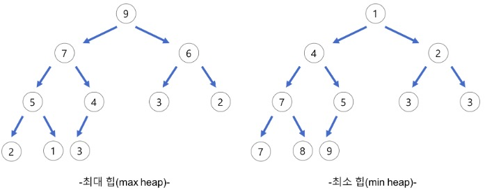

## Heap

</br>

- 힙(heap)은 **완전이진트리(Complete binary tree)**를 기본으로 한 자료구조(tree-based structure)

- 시간 복잡도

- * 삽입 - O(logN). O(h) = O(log(N + 1))

  * 삭제 - O(logN). O(h) = O(log(N + 1))

- 일반적으로 **배열**을 사용하여 **구현**한다.

- 완전이진트리는 최댓값 및 최솟값을 찾아내는 연산을 빠르게 하기 위해 고안

- 다음과 같은 힙 속성(property)을 만족한다.

  - A가 B의 부모노드(parent node) 이면, A의 키(key)값과 B의 키값 사이에는 대소관계가 성립한다.

  - 형제 노드끼리는 비교 불필요하다.

  - 힙에서의 부모 노드와 자식 노드의 관계

    왼쪽 자식의 인덱스 = (부모의 인덱스) * 2

    오른쪽 자식의 인덱스 = (부모의 인덱스) * 2 + 1

    부모의 인덱스 = (자식의 인덱스) / 2

* 우선 순위 큐를 만들기 위해 만들어진 자료 구조
* 최대힙(max heap) : 부모 노드의 키 값이 자식 노드의 키 값보다 크거나 같은 완전 이진 트리

* 최소힙(min heap) : 부모 노드의 키 값이 자식 노드의 키 값보다 작거나 같은 완전 이진 트리

</br>




</br>

</br>

### 최대힙(max Heap)

</br>

#### 삽입

1. 힙에 새로운 요소가 들어오면, 일단 새로운 노드를 힙의 마지막 노드에 이어서 삽입한다.

2. 새로운 노드를 부모 노드들과 교환해서 힙의 성질을 만족시킨다.

</br>


</br>

</br>

#### 삭제

1. 최대 힙에서 최댓값은 루트 노드이므로 루트 노드가 삭제된다.(최대 힙(max heap)에서 삭제 연산은 최댓값을 가진 요소를 삭제하는 것이다.)
2. 삭제된 루트 노드에는 힙의 마지막 노드를 가져온다.
3. 힙을 재구성한다.

</br>


</br>

</br>

### 구현

</br>

* 배열을 이용한 Heap 구현

```java
public class Heap {
	private int maxSize;
	public int arr[];
	private int size;

	public Heap(int maxSize) {
        this.maxSize = maxSize + 1;
		arr = new int[this.maxSize];
		Arrays.fill(arr, Integer.MIN_VALUE);
		size = 0;
	}

	public boolean isEmpty() {
		return (size == 0);
	}

	public boolean isFull() {
		return (size == maxSize - 1);
	}

	private void swap(int a, int b) {
		int temp = arr[a];
		arr[a] = arr[b];
		arr[b] = temp;
	}

	public void insert(int data) {
        if (isFull()) {
			throw new ArrayIndexOutOfBoundsException();
		}
		size++;
		int temp_index = size;
		arr[temp_index] = data;

		while (temp_index > 1) {
			int root = temp_index / 2;
			if (arr[temp_index] > arr[root]) {
				swap(root, temp_index);
				temp_index /= 2;
			} else {
				break;
			}
		}
	}

	public int delete() {
        if (isEmpty()) {
			throw new ArrayIndexOutOfBoundsException();
		}
		int start = 1;
		int max = arr[start];
		arr[start] = arr[size];
        // 배열 마지막에도 최소값 넣어주기!!!
		arr[size] = Integer.MIN_VALUE;
		size--;
        // while조건 주의 !!!
		while ((start * 2 + 1) < maxSize) {
			if ((arr[start] > arr[start * 2]) && arr[start] > arr[start * 2 + 1]) {
				break;
			} else if (arr[start * 2] > arr[start * 2 + 1]) {
				swap(start, start * 2);
				start = start * 2;
			} else {
				swap(start, start * 2 + 1);
				start = start * 2 + 1;
			}
		}
		return max;
	}
	
	public int size() {
		return size;
	}
}
```

</br>

</br>

### 참조

https://gmlwjd9405.github.io/2018/05/10/data-structure-heap.html