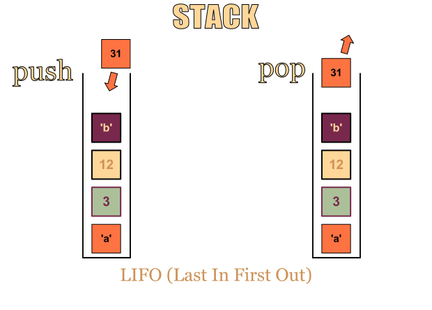

## Stack

</br>

선형 자료구조의 일종으로 Last In First Out (LIFO, 후입선출). 즉, 나중에 들어간 원소가 먼저 나온다. 이것은 Stack의 가장 큰 특징이다. 차곡차곡 쌓이는 구조로 먼저 Stack에 들어가게 된 원소는 맨 바닥에 깔리게 된다. 그렇기 때문에 늦게 들어간 녀석들은 그 위에 쌓이게 되고 호출 시 가장 위에 있는 녀석이 호출되는 구조이다



</br>

</br>

### 사용예

* 재귀 알고리즘
* 웹 브라우저 방문기록(뒤로가기)
* 실행 취소(undo)
* 후위 표기법 계산

</br>

</br>

### 구현

</br>

* Array 방식으로 Stack 구현 code

```java
class ArrayStack {
	private int top;
    private int maxSize;
    private int size;
    private Object[] arr;
    
    // 배열 스택 생성,  스택의 최대 크기로 생성
    public ArrayStack(int maxSize){
        this.maxSize = maxSize;
        this.arr = new Object[maxSize];
        this.top = -1;
    }
    
    // maxSize 설정 안했다면 100으로 초기화
    public ArrayStack() {
        this.maxSize = 100;
        this.arr = new Object[maxSize];
        this.top = -1;
    }
    
    // 스택이 비어있는지 체크
    public boolean isEmpty(){
        return (top == -1);
    }
    
    // 스택이 꽉찼는지 체크
    public boolean isFull(){
        return (top == maxSize-1);
    }
    
    // 스택에 item 입력
    public void push(Object item){
        if(isFull()) {
        		throw new ArrayIndexOutOfBoundsException("index : " + (top + 1));
        }
        arr[++top] = item;
        size++;
    }
    
    // 스택의 가장 위의 데이터 반환
    public Object peek(){
        if(isEmpty()) {
        		throw new ArrayIndexOutOfBoundsException("index : " + top);
        }
        return arr[top];
    }
    
    // 스택의 가장 위의 데이터 제거
    public Object pop(){
        Object item = peek();
        top--;
        size--;
        return item;
    }
    
    public int size() {
    	return size;
    }
```

</br>

</br>

* LinkedList 방식으로 Stack 구현 code

```java
public class ListStack {
    private Node top;	//들어오고 나가는 부분
    private int size;
    
    public ListStack(){
        this.top = null;
        this.size = 0;
    }
    
    private class Node {
    	private Object data;
    	private Node priorNode;
        
    	private Node(Object data) {
    		this.data = data;
    		this.priorNode = null;
    	}
    }
    
    public boolean isEmpty() {
        return (top == null);
    }
    
    public void push(Object data) {
        // 들어오는 부분만 생각
    	Node newNode = new Node(data);
    	newNode.priorNode = top;
    	top = newNode;
        size++;
    }
    
    public Object peek() {
    	if (isEmpty()) {
    		throw new ArrayIndexOutOfBoundsException();
    	}
    	return top.data;
    }
    
    public Object pop() {
        // 나가는 부분만 생각
    	Object data  = peek();
    	top = top.priorNode;
        size--;
    	return data;
    }
    
    public int size() {
    	return size;
    }
}
```


