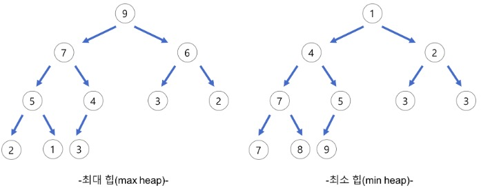

## Stack, Queue, Priority Queue, Deque, Heap

</br>

### Stack

선형 자료구조의 일종으로 Last In First Out (LIFO, 후입선출). 즉, 나중에 들어간 원소가 먼저 나온다. 이것은 Stack의 가장 큰 특징이다. 차곡차곡 쌓이는 구조로 먼저 Stack에 들어가게 된 원소는 맨 바닥에 깔리게 된다. 그렇기 때문에 늦게 들어간 녀석들은 그 위에 쌓이게 되고 호출 시 가장 위에 있는 녀석이 호출되는 구조이다


</br>

* LinkedList 방식으로 Stack 구현 code

```java
public class ListStack {
    private Node top;	//들어오고 나가는 부분
    private int size;
    
    public ListStack(){
        this.top = null;
        this.size = 0;
    }
    
    private class Node {
    	private Object data;
    	private Node priorNode;
        
    	private Node(Object data) {
    		this.data = data;
    		this.priorNode = null;
    	}
    }
    
    public boolean isEmpty() {
        return (top == null);
    }
    
    public void push(Object data) {
        // 들어오는 부분만 생각
    	Node newNode = new Node(data);
    	newNode.priorNode = top;
    	top = newNode;
        size++;
    }
    
    public Object peek() {
    	if (isEmpty()) {
    		throw new ArrayIndexOutOfBoundsException();
    	}
    	return top.data;
    }
    
    public Object pop() {
        // 나가는 부분만 생각
    	Object data  = peek();
    	top = top.priorNode;
        size--;
    	return data;
    }
    
    public int size() {
    	return size;
    }
}
```


</br>

</br>

### Queue

선형 자료구조의 일종으로 First In First Out (FIFO, 선입선출). 즉, 먼저 들어간 놈이 먼저 나온다. Stack 과는 반대로 먼저 들어간 원소가 맨 앞에서 대기하고 있다가 먼저 나오게 되는 구조이다. 참고로 Java Collection에서 Queue는 인터페이스이다


</br>

* LinkedList 방식으로 Queue 구현 code

```java
public class ListQueue {
	// 큐는 head노드와 tail노드를 가진다.
	// 큐는 스택과 다르게 삽입과 삭제가 다른 부분에서 이루어지기 때문에 두개의 node를 갖는다
	private Node head;	// 나가는부분
	private Node tail;	// 들어오는부분
	private int size;

	public ListQueue() {
		this.head = null;
		this.tail = null;
		this.size = 0;
	}

	private class Node {
		// 노드는 data와 다음 노드를 가진다.
		private Object data;
		private Node nextNode;

		Node(Object data) {
			this.data = data;
			this.nextNode = null;
		}
	}

	// 큐가 비어있는지 확인
	public boolean isEmpty() {
		return (head == null);
	}

	// data를 큐의 tail에 넣는다.
	public void add(Object data) {
		Node newNode = new Node(data);
		// 이부분 잊지 말기
		newNode.nextNode = null;
		if (isEmpty()) {
			tail = newNode;
			head = newNode;
		} else {
			// tail(들어오는 부분)만 생각
			tail.nextNode = newNode;
			tail = newNode;
		}
		size++;
	}

	// head의 데이터를 반환한다.
	public Object peek() {
		if (isEmpty())
			throw new ArrayIndexOutOfBoundsException();
		return head.data;
	}

	// head 를 큐에서 제거한다.
	// head(나가는 부분)만 생각
	public Object poll() {
		Object data = peek();
		size--;
		head = head.nextNode;
		// 이 부분 잊지 말기
		if (head == null) {
			tail = null;
		}
		return data;
	}

	public int size() {
		return size;
	}
}
```


</br>

</br>

### Priority Queue

일반적인 큐는 FIFO 자료구조 이기 때문에 먼저 들어온 데이터를 먼저 내보냈다면, 우선순위 큐는 우선순위가 높은 데이터를 먼저 내보내는 자료구조

새로운 노드를 삽입하면 우선순위에 맞게 위치에 삽입 (Enqueue)하고, 제거를 할 때는 가장 우선 순위가 높은 맨 앞에 노드를 빼면서 삭제(Dequeue)한다

우선순위 큐는 배열, 연결 리스트 또는 힙으로 구현 가능. 힙으로 구현한 우선 순위 큐가 가장 효율적(힙으로 구현할 경우 탐색, 삽입, 삭제 시간복잡도가 logn. 나머지는 n인 경우 있다)

</br>

</br>

### Deque

응용된 Queue. 원소의 삽입 및 삭제가 맨 앞쪽과 뒤쪽에서 둘 다 가능하다. Stack과 Queue의 기능이 합쳐진 형태

</br>

</br>

### Heap

- 힙(heap)은 **완전이진트리(Complete binary tree)**를 기본으로 한 자료구조(tree-based structure) (시간복잡도 : O(log N))

- 일반적으로 **배열**을 사용하여 **구현**한다.

- 완전이진트리는 최댓값 및 최솟값을 찾아내는 연산을 빠르게 하기 위해 고안

- 다음과 같은 힙 속성(property)을 만족한다.

  - A가 B의 부모노드(parent node) 이면, A의 키(key)값과 B의 키값 사이에는 대소관계가 성립한다.

  - 형제 노드끼리는 비교 불필요하다.

  - 힙에서의 부모 노드와 자식 노드의 관계

    왼쪽 자식의 인덱스 = (부모의 인덱스) * 2

    오른쪽 자식의 인덱스 = (부모의 인덱스) * 2 + 1

    부모의 인덱스 = (자식의 인덱스) / 2


* 우선 순위 큐를 만들기 위해 만들어진 자료 구조

* 최대힙(max heap) : 부모 노드의 키 값이 자식 노드의 키 값보다 크거나 같은 완전 이진 트리

  최소힙(min heap) : 부모 노드의 키 값이 자식 노드의 키 값보다 작거나 같은 완전 이진 트리

</br>




</br>

참조

https://gmlwjd9405.github.io/2018/05/10/data-structure-heap.html

</br>

```java
public class Heap {
	private static final int Max_Size = 101;
	public int arr[];
	private int size;

	public Heap() {
		arr = new int[Max_Size];
		Arrays.fill(arr, Integer.MIN_VALUE);
		size = 0;
	}

	public boolean isEmpty() {
		return (size == 0);
	}

	public boolean isFull() {
		return (size == Max_Size - 1);
	}

	private void swap(int a, int b) {
		int temp = arr[a];
		arr[a] = arr[b];
		arr[b] = temp;
	}

	public void insert(int data) {
        if (isFull()) {
			throw new ArrayIndexOutOfException();
		}
		size++;
		int temp_index = size;
		arr[temp_index] = data;

		while (temp_index > 1) {
			int root = temp_index / 2;
			if (arr[temp_index] > arr[root]) {
				swap(root, temp_index);
				temp_index = temp_index / 2;
			} else {
				break;
			}
		}
	}

	public int delete() {
        if (isEmpty()) {
			throw new ArrayIndexOutOfBoundsException();
		}
		int start = 1;
		int max = arr[start];
		arr[start] = arr[size];
		arr[size] = Integer.MIN_VALUE;
		size--;
		while (size > 0) {
			if ((arr[start] > arr[start * 2]) && arr[start] > arr[start * 2 + 1]) {
				break;
			} else if (arr[start * 2] > arr[start * 2 + 1]) {
				swap(start, start * 2);
				start = start * 2;
			} else {
				swap(start, start * 2 + 1);
				start = start * 2 + 1;
			}
		}
		return max;
	}
	
	public int size() {
		return size;
	}
}
```

