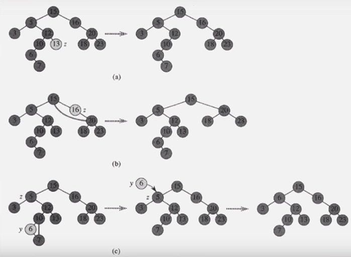

## Tree

 

노드가 N개인 트리는 항상 N-1개의 링크를 갖는다

임의의 두 노드간 경로는 유일하다(같은 노드를 두 번 이상 방문하지 않는다는 전제 조건 아래)

 

 

### 이진트리(Binary Tree)

각 노드는 최대 2개의 자식을 갖는다

각각의 자식 노드는 자신이 부모의 왼쪽 자식인지, 오른쪽 자신인지 지정된다.(자식 노드가 한 개인 경우에도)

 

 

**complete binary tree(완전 이진 트리)**

* 마지막 level만 두 개로 꽉 차지 않은 binary tree(1개만 존재)
* 마지막 level은 꽉 차 있지 않아도 되지만, node가 왼쪽에서 오른쪽으로 채워져야 한다

* node가 n개인 complete binary tree의 높이(h)는 log2(n + 1)이다

 

**full binary tree(전 이진 트리)**

* 모든 node가 0개 또는 2개의 자식 노드를 갖는 트리

 

**perfect binary tree(포화 이진 트리)**

* 모든 내부 node가 두 개의 자식 node를 갖는다
* node가 n개인 complete binary tree의 높이(h)는 log2(n + 1)이다
* node의 개수가 정확히 2^h - 1개

 

 

#### 구조

일반적인 이진 트리는 p.b.t 또는 c.b.t 처럼 각 node간 index의 규칙성이 없다. 따라서 각 node는 왼쪽 자식과 오른쪽 자식의 node 주소를 갖고 있으며, 때때로 부모 node의 주소도 갖고 있는 경우도 있다. 연결 구조로 표현. root node의 주소는 따로 보관한다.

 

 

#### 순회

* 선순위(preorder) : root - T(left) - T(right)

* 중순위(inorder) : T(left) - root - T(right)

* 후순위(postorder) : T(left) - T(right) - root

* levelorder : 위 level부터, 각 level의 왼쪽에서부터 오른쪽으로 순회

 

 

### 이진 검색 트리(Binary Search Tree)

임의의 node v에 대해서 v왼쪽의 sub tree는 v값보다 작거나 같고, 오른쪽의 sub tree는 v값보다 크거나 같다.

 

(h : tree의 높이)

* **successor** : 해당 node보다 크거나 같은 값 중 가장 작은 값을 가진 node, successor 찾는 시간 복잡도는 O(h)
  * node v의 오른쪽 subtree가 존재 할 경우 : 오른쪽 subtree의 최소값(가장 왼쪽 값)

  * node v의 오른쪽 subtree가 존재 안할 경우 : 부모 node 따라 올라가는데, 처음으로 left edge(내려오는 기준)를 탈때 만나는 node

  * node v가 최대값이면 successor 없다
* **predecessor** : 해당 node보다 작거나 같은 값 중 가장 큰 값을 가진 node, predecessor 찾는 시간 복잡도는 O(h)
* * successor 찾는 방식과 반대

 

 

#### 시간복잡도

* **Search** : O(h)

* **Insert** : O(h), 처음 삽입한 node가 root node. 새로 node가 삽입 될 때, 기존의 node들은 그 자리를 유지한채로 새 node만 B.S.T를 유지하면서 삽입된다

* **Delete** : O(h)

* * 자식 node가 없을 경우 : 삭제하고자 하는 node만 트리에서 제거 (O(1))

  * 자식 node가 1개 : 삭제하고자 하는 node 제거하고, 그 node의 자식 node를 부모 node와 연결 (O(1))

  * 자식 node가 2개 : 삭제하고자 하는 node 제거하고, 제거 한 자리에 그 node의 **successor**를 복사한 뒤, copy 당한 node를 없앤다. 이 때에도 마찬가지로 자식 node 개수(0개 or 1개)에 따라 위와 같은 방법으로 제거한다(O(h))

     

 

 

### Red Black Tree ###

기본적으로 이진검색트리 형태. 하지만 키의 삽입이나 삭제시 tree가 balanced될 수 있도록 하여, 시간복잡도를 O(log2(n))으로 유지시킨다(tree의 높이를 log2(n)으로 유지)

http://zeddios.tistory.com/237

http://thesoul214.tistory.com/113

 

 

### 그래프와 트리의 차이

 

 

 

### 참조

 

https://gmlwjd9405.github.io/2018/08/12/data-structure-tree.html