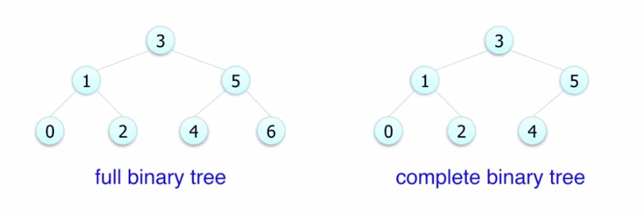
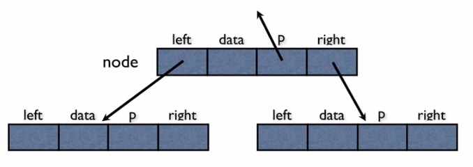
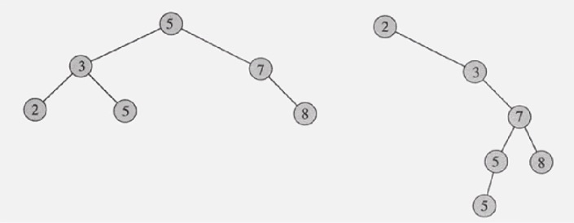

## Tree

노드가 N개인 트리는 항상 N-1개의 링크를 갖는다

임의의 두 노드간 경로는 유일하다(같은 노드를 두 번 이상 방문하지 않는다는 전제 조건 아래)

### 이진트리(Binary Tree)

각 노드는 최대 2개의 자식을 갖는다

각각의 자식 노드는 자신이 부모의 왼쪽 자식인지, 오른쪽 자신인지 지정된다.(자식 노드가 한 개인 경우에도)

**complete binary tree(완전 이진 트리)** : 마지막 level만 두 개로 꽉 차지 않은 binary tree

높이가 h인 full binary tree는 2^h - 1개의 node를 갖는다

node가 n개인 full 혹은 complete binary tree의 높이(h)는 log2(n)이다

 

#### 구조

일반적인 이진 트리는 f.b.t 또는 c.b.t 처럼 각 node간 index의 규칙성이 없다. 따라서 각 node는 왼쪽 자식과 오른쪽 자식의 node 주소를 갖고 있으며, 때때로 부모 node의 주소도 갖고 있는 경우도 있다. 연결 구조로 표현. root node의 주소는 따로 보관한다.

 

#### 순회

* 선순위(preorder) : root - T(left) - T(right)

* 중순위(inorder) : T(left) - root - T(right)

* 후순위(postorder) : T(left) - T(right) - root

* levelorder : 위 level부터, 각 level의 왼쪽에서부터 오른쪽으로 순회

 

### 이진 검색 트리(Binary Search Tree)

임의의 node v에 대해서 v왼쪽의 sub tree는 v값보다 작거나 같고, 오른쪽의 sub tree는 v값보다 크거나 같다.

#### 시간복잡도

Search : O(logN)

Insert : O(logN), 처음 삽입한 node가 root node. 새로 node가 삽입 될 때, 기존의 node들은 그 자리를 유지한채로 새 node만 삽입된다

Delete : O(logN)

 

### Red Black Tree ###

http://zeddios.tistory.com/237

http://thesoul214.tistory.com/113